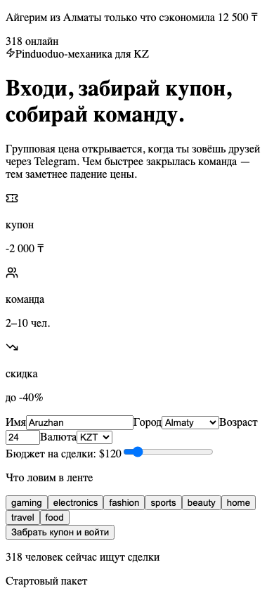
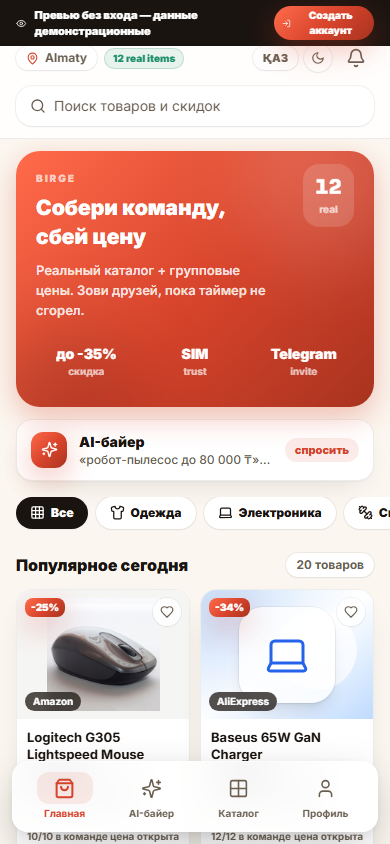
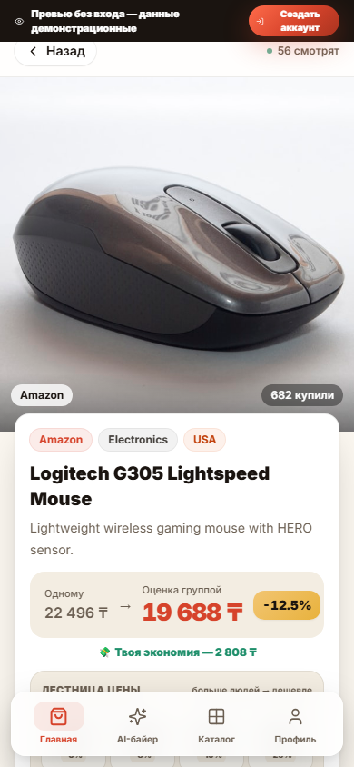
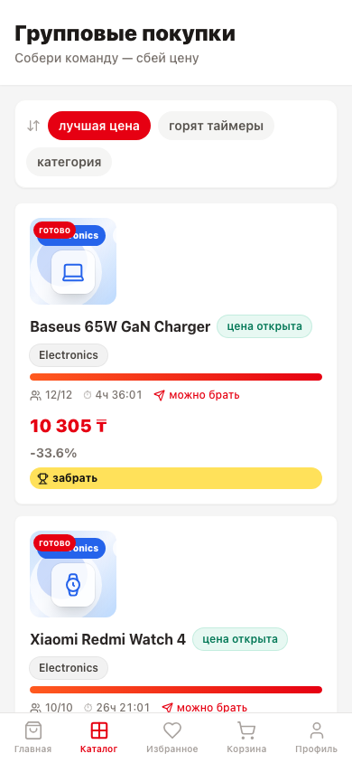
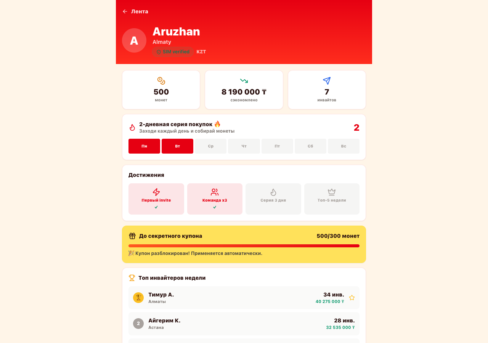
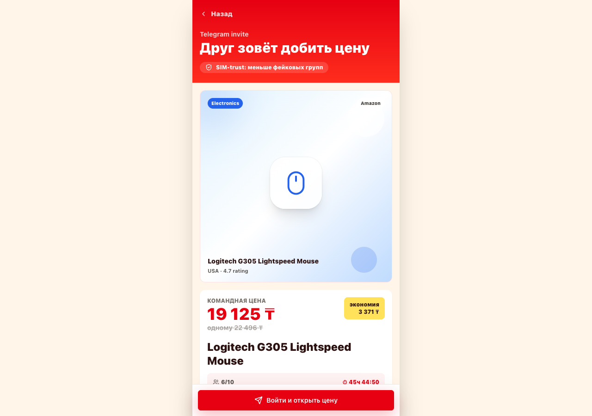

# GroupBuy KZ

> Pinduoduo-style collective buying for Kazakhstan — find a deal, build a team, send one Telegram link, watch the price drop in real time.


---

## The Viral Loop

```
User opens feed → claims coupon → joins group → copies invite link
       ↓                                                ↓
  coins + mission                          friends arrive via Telegram
       ↓                                                ↓
 daily streak                          price drops with each member
                                                        ↓
                                             deal closes → success modal
                                                        ↓
                                              everyone invites more people
```

Every invite has **visible, immediate value** — the price on screen drops the moment a friend joins. That's the mechanic judges remember.

---

## Screenshots

| Register | Feed |
|----------|------|
|  |  |

| Product page | Groups |
|--------------|--------|
|  |  |

| Profile & Leaderboard | Telegram Invite Landing |
|-----------------------|------------------------|
|  |  |

---

## Features

### Core mechanics
- **Group pricing** — linear interpolation from `price_individual` to `price_group_min` as members fill the team. Every join drops the price for everyone.
- **Optimistic UI** — price updates instantly on click, then reconciles with the server response. Zero perceived latency.
- **Friend simulation** — "Copy invite" triggers a scripted sequence: friends arrive, join, price drops, deal closes. Demos in 30 seconds.
- **Telegram share** — native deep link with pre-filled message and group URL. One tap from the product page.

### Engagement & retention
- **Live activity toasts** — floating notifications ("Айгерим вступила через Telegram", "Команда закрылась!") make the platform feel alive without real traffic
- **Ticking countdown timers** — real-time urgency. Turns orange < 1 hour, red < 10 minutes
- **"N watching now"** counter on product pages — social proof
- **Daily mission bar** — 3 actions → unlock hidden coupon. Progress visible on every page
- **Gamified coupons** — 4 claimable coupons, each adds coins and mission progress
- **Coin wallet** — earned by claiming coupons, completing missions, inviting friends
- **Day streak tracker** — visual Пн–Вс grid, pushes daily return
- **Achievements** — Первый invite, Команда x3, Серия 3 дня, Топ-5 недели
- **Leaderboard** — top inviters of the week with savings shown

### Discovery & trust
- **AI-powered feed** — tag-intersection + budget-bonus recommender scores each product per user
- **Real search** — filters by product name and tags live as you type
- **SIM/eSIM trust badge** — UI concept: device marked verified to reduce fake groups
- **Category filters + budget slider** — instant client-side filtering
- **"Горящие команды"** — top-3 groups by fill progress, shown on every feed page

---

## Stack

| Layer | Tech |
|-------|------|
| Frontend | Next.js 14 App Router, TypeScript, Tailwind CSS |
| State | Zustand with `persist` middleware (localStorage) |
| Icons | lucide-react |
| Backend | FastAPI, Pydantic v2, Python 3.11 |
| Package mgr | pnpm (frontend), uv (backend) |
| Data | JSON seed files — no database |
| Auth | Mock JWT in localStorage |

---

## Quick Start

**Backend**

```bash
cd backend
uv sync
uv run uvicorn main:app --reload --host 127.0.0.1 --port 8000
```

**Frontend**

```bash
cd frontend
pnpm install
pnpm dev
```

**Open** → `http://127.0.0.1:3000/feed`

**Optional env** (frontend already defaults to this):

```bash
# frontend/.env.local
NEXT_PUBLIC_API_URL=http://127.0.0.1:8000
```

---

## Demo Script (30 seconds)

1. Open `/feed` — note live activity toast in bottom-left, online counter in header
2. Click a coupon — coins animate up, mission bar advances
3. Open **Dyson Supersonic** or **Logitech G305**
4. Click **"Войти в команду"** — price drops instantly, button changes
5. Click **"Скопировать invite"** — friends start arriving in the live events feed
6. Watch the deal close — success modal with savings and Telegram share
7. Open `/join/g002` — show the Telegram landing page a friend receives
8. Open `/groups` — show all teams sorted by savings, ticking timers, 🔥 badges
9. Open `/profile` — coins, streak, achievements, leaderboard

---

## Routes

| Route | Description |
|-------|-------------|
| `/register` | Onboarding: name, city, interests, budget, SIM-trust concept |
| `/feed` | Deal catalog with coupons, hot teams, daily mission, search, filters |
| `/product/[id]` | Team-buy page — hero interaction: join → invite → price drop |
| `/join/[groupId]` | Telegram invite landing for incoming friends |
| `/groups` | All active teams, sortable by savings / timer / category |
| `/profile` | Coins, streak, achievements, leaderboard, active deals |

---

## API

All responses:

```json
{ "data": {}, "success": true, "message": "OK" }
```

| Method | Endpoint | Description |
|--------|----------|-------------|
| `POST` | `/auth/register` | Create user, return mock JWT |
| `POST` | `/auth/login` | Login by user_id |
| `GET` | `/products` | All products |
| `GET` | `/products/{id}` | Product + active group |
| `GET` | `/feed?user_id=&limit=` | Personalized feed via recommender |
| `GET` | `/groups` | All active/completed groups |
| `GET` | `/groups/{id}` | Group + product detail |
| `POST` | `/groups/{id}/join` | Join group, recalculate price |
| `GET` | `/recommend?user_id=&limit=` | Tag-scored recommendations |

---

## How Pricing Works

```python
# Linear interpolation as team fills
progress = current_members / threshold          # 0.0 → 1.0
discount = price_individual - price_group_min
price = price_individual - discount * progress  # drops smoothly
```

The same formula runs identically in Python (backend) and TypeScript (frontend) for optimistic updates.

---

## Recommender

```python
# Tag intersection + budget bonus scoring
overlap = len(user.interests ∩ product.tags) / len(user.interests)
budget_bonus = 1.5 if product.price_individual <= user.budget_usd else 0.8
score = (overlap * budget_bonus, product.rating)
```

---

## Project Structure

```
backend/
├── data/           seed JSON — demo products + 200 real Open Facts products
├── models/         Pydantic v2 schemas
├── routers/        auth · products · feed · groups · recommend
└── services/       group_pricing.py · recommender.py

frontend/
├── app/
│   ├── (auth)/register/
│   ├── feed/
│   ├── product/[id]/
│   ├── join/[groupId]/
│   ├── groups/
│   └── profile/
├── components/
│   ├── auth/       SimBadge
│   ├── product/    ProductCard · ProductVisual · GroupProgress · PriceComparison
│   └── ui/         Button · Badge · Card · Modal · ProgressBar
│                   CountdownTimer · LiveActivity · DealSuccessModal
├── lib/            api.ts · store.ts · utils.ts
└── types/          index.ts — full API contract mirrors
```

---

## Seed Data Reset

Joining a group mutates `backend/data/groups.json`. Reset before a fresh demo:

```bash
git checkout backend/data/groups.json
```

## Real Product Catalog

The catalog includes 200 real products imported from public Open Facts APIs:

- `OpenFoodFacts` — real food items with barcode/source URLs and product photos
- `OpenBeautyFacts` — real beauty/cosmetics items
- `OpenProductsFacts` — real non-food catalog items

Some products also include observed store prices from Open Prices (`source_price`, `source_currency`, `source_location`). To refresh the real catalog while preserving demo products used by active groups:

```bash
node scripts/import_openfacts_products.mjs
```

---

## Quality

```bash
# TypeScript
cd frontend && pnpm exec tsc --noEmit

# Python syntax
cd backend && python3 -m compileall . -q

# Production build
cd frontend && pnpm run build
```

---

## What's Mock / What's Real

| Feature | Status |
|---------|--------|
| Group pricing algorithm | ✅ Real math |
| Recommender | ✅ Real scoring |
| Optimistic UI | ✅ Real pattern |
| Countdown timers | ✅ Real ticking |
| Price drop animation | ✅ Real CSS transition |
| Live activity toasts | 🎭 Scripted (no real users) |
| "Viewing now" counter | 🎭 Simulated drift |
| Friend simulation | 🎭 Scripted timeouts |
| SIM/eSIM verification | 🎭 UI concept only |
| Payments | 🎭 Not implemented |
| JWT auth | 🎭 Mock token |
| Database | 🎭 JSON files |
